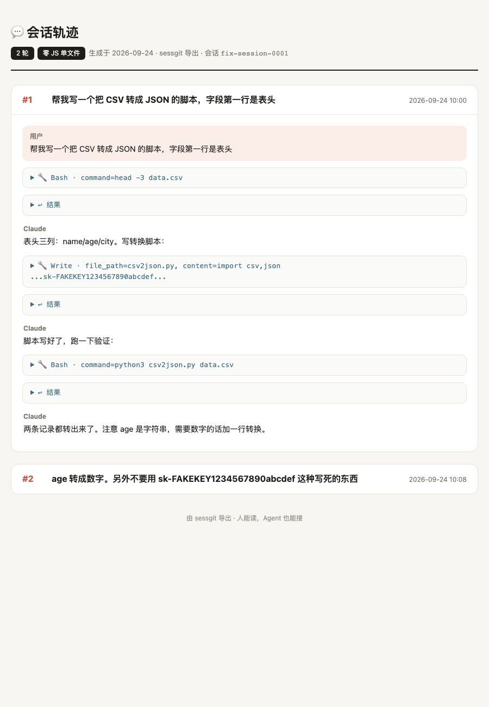

# sessgit

**给 AI 会话做版本管理——为交接和分享而生。零账号、零服务器、零依赖（git 除外）。**

一次用户发言 = 一个 git commit。别人可以基于你的对话轨迹继续项目，也可以用一个 HTML 文件看到完整的沟通过程。



```bash
python3 sessgit.py init                    # 项目里建 .sessgit/
python3 sessgit.py import 会话.jsonl        # 导入 Claude Code 会话
python3 sessgit.py log                     # 逐轮历史
python3 sessgit.py show -n 20              # 读前 20 轮对话
python3 sessgit.py export                  # 单文件 HTML（分享给人）
python3 sessgit.py handoff                 # 交接 markdown（喂给下一个 Agent）
```

## 为什么自己造

市面上的同类工具（如 AgentGit）要做 hub、只读链接、跨机器同步——所以起手要注册账号、
默认开启遥测、版本必须署名到它的服务器。实测结论：**不注册只有半个工具**。

sessgit 的取舍正好相反：

| | 需要 hub 的工具 | sessgit |
|---|---|---|
| 分享 | 生成链接（经过服务器，可能过期） | **发文件**（单文件 HTML，零 JS，永远打得开） |
| 账号 | 必须 | **不存在这个概念** |
| 遥测 | 默认开 | **没有网络代码** |
| 交接 | resume 自己的会话 | `handoff.md` 喂给任何新会话/新工具 |

## 设计

- **存储就是 git**：`.sessgit/` 是个普通 git 仓库，每轮一个 commit。你会的全部 git 操作都适用
- **导出前扫密钥**：`export` 默认拒绝带疑似 API key / token / 私钥的内容出门（`--yes` 才放行，自己把关）
- **解析器经过真实验证**：30.3MB / 5827 条事件的真实会话，0.10s 解析、184 轮切分，
  工具结果、命令回显、系统注入、中断标记、粘贴外壳全部正确排除

## 不做什么

hub、分享链接、跨机器同步、merge agent、多 runtime 适配（暂只支持 Claude Code）。
这些要么需要账号体系，要么等真需要再说。

## 状态

v0.1 · 单文件 · ~350 行 · 标准库 only。

## License

MIT
